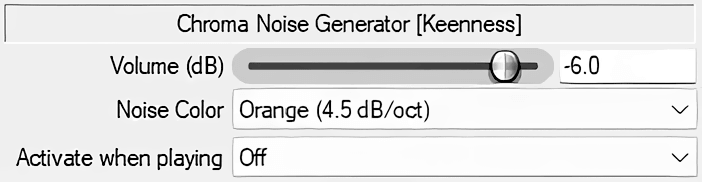
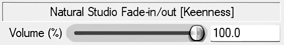

# JSFX
The _Keenness Recordings_ collection of high-quality JSFX (JesuSonic) scripts for REAPER.

## Included Plugins

### 1. Chroma Noise Generator

A versatile noise generator providing spectrally accurate noise profiles calibrated to maintain flat frequency responses relative to their target slopes.

**Demo:**

<https://github.com/user-attachments/assets/ca527f74-3943-483b-9ac3-98bba97e0933>

**Noise Colors:**

| **Color**  | **Slope**  | **Description**                                      |
| ---------- | ---------- | ---------------------------------------------------- |
| **White**  | 0 dB/oct   | Equal energy per frequency.                          |
| **Pink**   | 3 dB/oct   | An established industry standard.                    |
| **Orange** | 4.5 dB/oct | The default in Voxengo SPAN and FabFilter analysers. |
| **Brown**  | 6 dB/oct   | Low-frequency emphasis.                              |

**Key Features:**

- Integrated DC Offset Blocking.
- Loudness normalization between noise colors.
- Auto-mute when the DAW transport is stopped.

### 2. Natural Studio Fade-in/out

Inspired by Audacity's native studio fade, this script creates an analogue-sounding fade that mimics the psychoacoustic effect of a sound source getting closer or moving away.

**Demo 1 (15s fade-out):**

<https://github.com/user-attachments/assets/f7fdd913-bd7f-44cb-aa6b-8aa63daad962>

**Demo 2 (comparison with iZotope RX and Audacity Studio fade-out):**

<https://github.com/user-attachments/assets/6369b299-64f2-4adb-a3e0-cf56e1a66cd9>

**How it works:**

- **Dynamic Filtering:** Simultaneously applies subtle low-shelf and high-shelf filters as volume changes to simulate the sensation of sound pressure changes.
- **Stereo Narrowing:** Gradually attenuates the Side channel to narrow the stereo width during the fade, enhancing the "moving away" effect.

**Pro Tip:** For the most musical results, place this at the end of your master chain and automate the Volume slider using a **Cosine (Slow start/end)** envelope curve.

## Installation

1. Download the `.jsfx` files from `keenness` folder.
2. In REAPER, go to `Options > Show REAPER resource path in explorer/finder`.
3. Navigate to the `Effects` folder.
4. Create a subfolder named `keenness` and paste the files there.
5. In the REAPER FX browser, right-click and select **"Scan for new plugins"**.

## License

Distributed under the **MIT License**.
